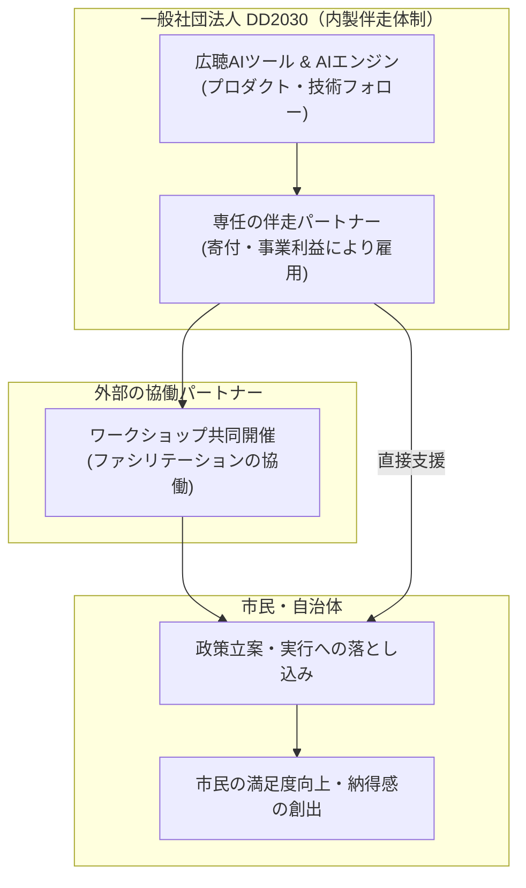

# 広聴AIを広める目的と普及戦略の整理ドキュメント

本ドキュメントは、「dd2030の広聴AI（以下、広聴AI）を広める必要があるのか、またなぜ広めるのか」について、小野翔太氏のアイデアや問いかけをベースに、AI（AIアシスタント）との壁打ちディスカッションを通じて、着想とAIによる構造化を共同で編み上げた普及戦略の整理メモです。

---

## 1. なぜ「広聴AI」を広めるのか？（究極の目的）

### 💡 民主主義のアップデートとアジェンダ設定権の開放

従来の民主主義（特に日本の行政や政治の現場）における意見公募やアンケートには、**「アジェンダ（議題）設定の権限を行政側が独占している」**という本質的な課題があります。
従来の選択式アンケート（クローズドクエッション）は、設計者の想像力の範囲内でしか意見を測ることができず、そこから漏れた「サイレントマジョリティの切実な声」や「少数派の新しい視点」は存在しなかったことにされてきました。

広聴AIを広める究極の目的は、LLMを用いた自由記述（オープンクエッション）の大規模解析を通じて、**アジェンダ設定の権限を市民に開放し、住民と行政との間の信頼関係を再構築する（＝民主主義のアップデート）**ことにあります。

---

## 2. 広聴AIの本質的価値（アンケートとの決定的な違い）

広聴AIを世の中に広めていく際、従来のアンケートやパブリックコメントの単なる「集計効率化ツール」と混同されないよう、その本質的な違いを整理しておく必要があります。

| 評価軸           | 従来の選択式アンケート                       | 広聴AI（ブロードリスニング）                |
| :--------------- | :------------------------------------------- | :------------------------------------------ |
| **質問形式**     | クローズドクエッション（選択肢）             | オープンクエッション（自由記述）            |
| **分析の種類**   | **定量分析**（何がどれくらいあるか）         | **定性分析**（そもそも何があるか）          |
| **統計的代表性** | 高い（無作為抽出により全体の比率を再現可能） | 低い（声を上げた人の意見に偏る）            |
| **主な価値**     | 仮説の**検証**（多数派の意思決定）           | 新しいインサイト・アジェンダの**発見**      |
| **解析コスト**   | 低い（数値データの自動集計）                 | 従来は極めて高かったが、**LLMにより極小化** |

> [!WARNING]
> **「世論の支持率」と誤読するリスク（サイエンス風の罠）**
> 広聴AIのレポートは「散布図」や「クラスタごとの意見数」が表示されるため、客観的な定量データに見えがちです。しかし、これは「声を強く上げた人」のデータに偏っており、サイレントマジョリティ（関心のない大多数）の声は反映されません。
> **「クラスタの大きさ ＝ 社会における支持率」と解釈することは、広聴AIにおける最大の誤用**です。

---

## 3. 誰に広めるのか？（初期ターゲットとペルソナ）

すべてのセグメントに同時にアプローチするのではなく、意思決定の実行力や導入バイアスを考慮し、フォーカスを絞ります。

### 🎯 地方自治体（最優先ターゲット）

初期においては、ユーザーを**「地方自治体」**にフォーカスします。

- **狙うべき自治体の特徴**：
  首長の熱量（トップダウン）と、現場（広聴課やデジタル推進課）の実行力（ボトムアップ）の両方が揃っている先進自治体。3年以上のスパンでデータマネジメント改革に取り組む忍耐力のある組織が理想です。
- **ターゲット内のステークホルダー**：
  首長は「市民の声を聴く先進的な姿勢」をアピールしたいため導入を望みますが、現場の職員は予算化や業務負荷の面で追いつかないケースがあります。このギャップを埋める提案（後述のDXと伴走）が必要です。

### ⚠️ その他のセグメントに対する注意点

- **政治家・政党**：主に選挙のための広報効果を狙う傾向が強く、政権与党以外は政策への直接的な実行力を持ちにくいため、副次的なターゲットとします。
- **メディア**：あまり多用されると、厳密な「世論調査」との対比や誤読を生むリスクがあるため、取り扱いに注意が必要です。

---

## 4. 「成功」と「価値創出」の定義

広聴AIを「ただ使ってみた」だけで終わらせず、本来の民主主義のアップデートに繋げるための評価フレームワークです。

### 📈 価値創出フレームワーク

プロジェクトのフェーズを以下のように分類し、最終段階まで到達させることを目指します。

- **「形骸化」への警告**：
  ユーザーから「見やすくてよかったです」という感想しか得られない場合、それは内容についてのインサイト（新しい発見・視点）がなかった＝実質的に役に立っていないことを意味します。「広聴AIを使っています」という仕事をしている風に見せるだけの広報効果（形骸化）に陥らないよう、最後の「政策反映化 ➔ 市民の満足度向上」まで追う必要があります。

---

## 5. 「点」から「線」へ：継続的な対話と時系列分析の価値

広聴AIは、1度だけの「単発使用」で終わらせるのではなく、複数回にわたり継続的に使用し、対話の進捗を時系列で追うことで真価を発揮します。
単なる一時点の要約ではなく、対話プロセスを通じて「住民の意見がどう変容したか（分断が滑らかになり、合意形成へ向かうプロセス）」を可視化することは、以下の実務的な価値をもたらします。

### 1️⃣ 対話の伴走パッケージ（ワークショップ型）：議論の再調整

数ヶ月〜1年におよぶ自治体の計画策定において、対話ワークショップの「前・中・後」で広聴AIを実行します。対話を重ねる中で、当初対立していた極端な論点が、共通の土台（コモン・グラウンド）へと滑らかに移行・収斂していくプロセスをマップで把握し、ファシリテーターや担当者が「次にどの論点にフォーカスして対話を進めればよいか」を的確に設計・再調整します。

- **実務上の課題とプロダクトでのアプローチ**：
  この時系列変化の分析や対話への応用は、担当者やファシリテーターのスキル・時間的余裕に大きく依存します。そのため、広聴AIのモジュール性を活かし、**時系列での意見変容や分断の推移を直感的に把握できる『ワークショップ伴走用ビュー・プラグイン（可視化プラグイン）』等のプロダクト開発**によって、分析の難易度と現場の認知的負荷を劇的に下げることが重要です。

### 2️⃣ 常設コミュニティ（Decidim等）の定点モニタリング：アジェンダの早期察知

市民参加プラットフォーム（Decidimなど）の意見データを定期的（例：隔月）に広聴AIへ投入します。市民意見のトレンド変化をダッシュボード化し、行政が住民の新たな関心や潜在的な不満（新しいアジェンダの兆候）を早期に察知し、先回りで対応するための定点観測ツールとして機能させます。

### 3️⃣ 合意形成のエビデンス（評価指標）として首長へ提示：納得感の証明

デリケートで炎上しやすい政策決定において、「対話プロセスを重ねた結果、住民の懸念や対立がこのように滑らかに解消へ向かった」という合意形成の進捗・成果を客観的な評価指標（エビデンス）として、首長や行政幹部、そして市民自身へ提示します。これにより、単なる『話し合いのポーズ』ではなく、本当に対話が機能したことの説得力と納得感を高めます。

---

## 6. ボランティアからの脱却：一般社団法人化と「内製伴走」へのシフト

### 🏢 一般社団法人化による組織体制の強化
これまでDD2030は主に有志によるボランティア団体として活動してきましたが、持続可能な活動基盤を構築するため、**「一般社団法人化」**することが決定しました。
これにより、今後は寄付や事業収益などの資金を基に、**「広聴AIの導入・活用を現場で成果が出るまで支援する伴走パートナー（コーディネーター）」の内製雇用**が可能になります。

### 🤝 技術フォローから成果創出までの一貫支援
従来の「外部の導入パートナーのみに依存するエコシステム」では、技術的なフォローや単なるツールの導入だけで活動が終了してしまい、本来の目的である「政策反映」や「市民の満足度向上」まで辿り着かないリスクがありました。
今後は一般社団法人DD2030自身が、技術的なサポート（プロダクト提供）にとどまらず、**「成果（市民への価値提供）を出すところまで、自治体に直接寄り添って伴走できる専任人材」を組織内に抱えることで、責任ある一貫した合意形成支援**を提供します。

- **有力なパートナー候補（協働先）**：
  - **Code for Japan**（すでに自治体ネットワークやDecidimの導入支援実績を持つ）
  - **ファシリテーター型のコンサルタント・まちづくり団体**（行政の現場に入り込み、住民と一緒にマップを解釈して活動を企画する）
  - **Polipoli等の政策提言プラットフォーム**

---

## 7. プロダクト・セールのネクストアクション

マーケティング戦略を実行に移すための具体的なアジェンダです。

- **セールス：既存TTTCユーザーへのアプローチとパブコメ連携**
  - 現在「Talk to the City（TTTC）」を独自に利用している先進ユーザーに対し、日本語に最適化された「広聴AI」との違い（マトリクス表）を提示して移行・導入を促します。
  - 「パブリック・コメントの補助ツール」として位置づけ、既存のパブコメデータやSNSのデータを短時間で集約・可視化できる実用性をアピールします。
- **プロダクト：サービス化の推進とAIエンジンの精度向上**
  - API Keyを登録すれば、インストール不要ですぐにブラウザ上で試せる「サービス化」を最優先で推進します（導入ハードルの低下）。
  - 鈴木氏指摘の技術課題（カテゴリーの不自然な合体、分類ミス、ノイズ処理、インサイト発見能力の強化）に対応し、エンジンの品質を「実用に耐えうるレベル」へと磨き上げます。
  - 継続的な対話支援を容易にするため、広聴AIのモジュール性を活かし、時系列での意見の変化やコモン・グラウンドへの収斂を直感的に可視化・分析できる**「ワークショップ伴走用ビュー・プラグイン」の開発**を計画します。
  - 改善時のペルソナ（エンジニア・開発視点）と、マーケティング時のペルソナ（自治体職員・首長視点）を明確に分けてプロダクトを設計します。

---

## 📄 出典・ライセンス表記

本ドキュメントの作成にあたっては、デジタル民主主義2030が公開している以下の著作物、および[マーケティング戦略ミーティング（2025年7月16日開催）](https://docs.google.com/document/d/1qm7I_xEUE0kB8MuQrR_cNOKUerQgbvzFy3CXtUowfgA/edit?usp=sharing)の議事録のインサイトを参考に、一部引用および改変を行っています。

- **対象著作物**：『選挙を変えたブロードリスニング 生成AIが実現する民意の可視化と分析(仮)』（特に第2章「ブロードリスニングとアンケートの違い、定量分析から定性分析へ」）
- **元リポジトリ**：[digitaldemocracy2030/broad-listening-book](https://github.com/digitaldemocracy2030/broad-listening-book)
- **ライセンス**：[CC BY-NC 4.0（クリエイティブ・コモンズ 表示 - 非営利 4.0 国際）](https://creativecommons.org/licenses/by-nc/4.0/deed.ja)

_※本ドキュメントは、上記の元著作物および議論のインサイトをマーケティングおよび普及戦略の文脈に合わせて要約・改変した二次的著作物です。_
